<h2>TensorFlow-FlexUNet-Image-Segmentation-Brain-Tumor-Balanced-MRI (2026/06/30)</h2>
Sarah T.  Arai 
Software Laboratory antillia.com  
This is the first experiment of Image Segmentation for
<a href="https://www.kaggle.com/datasets/ramanarasimhakanduri/brain-tumour-dataset">
 <b>Brain Tumor MRI Multi-Source Balanced Set</b> 
</a> based on our <a href="https://github.com/sarah-antillia/TensorFlow-FlexUNet-Image-Segmentation-Model">
TensorFlow-FlexUNet-Image-Segmentation-Model</a> 
(TensorFlow Flexible UNet Image Segmentation Model for Multiclass) , 
and a 512x512 pixels PNG
<a href="https://drive.google.com/file/d/1zdPIMVlcaAoBR5aVkQ6d6Tu_KgSvg8ks/view?usp=sharing">
<b>Brain-Tumor-Balanced-MRI-ImageMask-Dataset.zip</b></a> with colorized masks 
(<a href="https://creativecommons.org/licenses/by-sa/4.0/">CC BY-SA 4.0</a>), which was derived by us from   
<a href="https://www.kaggle.com/datasets/yashharwani/brain-tumor-mri-multi-source-balanced-set">
<b>Brain Tumor MRI Multi-Source Balanced Set</b> </a> by Yash Harwani.
  

<b>Actual Image Segmentation for Brain-Tumor-Balanced-MRI of 512x512 pixels </b> 
As shown below, the inferred masks predicted by our segmentation model trained by the dataset appear similar to the 
ground truth masks. However, in the second case, this model failed to segment Glioma <b>greem</b> region.
  
<b>class_color_map = {Meningioma:blue, Glioma:green, Pituitary tumor:red}
</b>
  
<table>
<tr>
<th>Input: image</th>
<th>Mask (ground_truth)</th>
<th>Prediction: inferred_mask</th>
</tr>
<tr>
<td>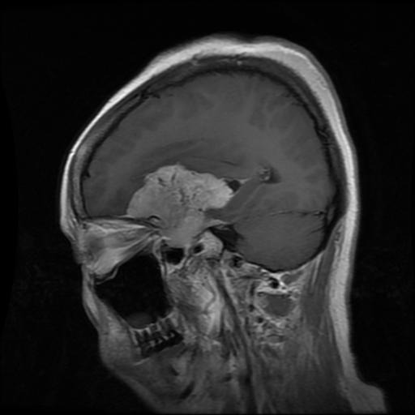</td>
<td>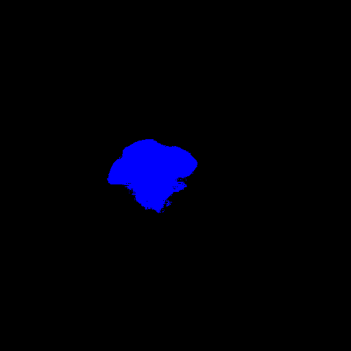</td>
<td>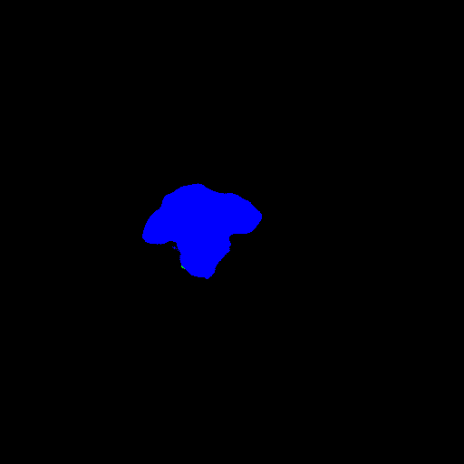</td>
</tr>

<tr>
<td>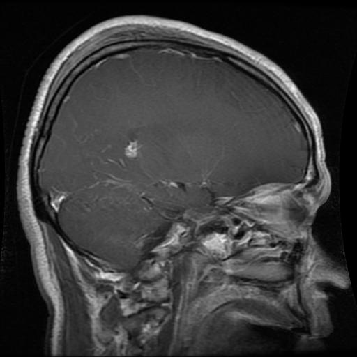</td>
<td>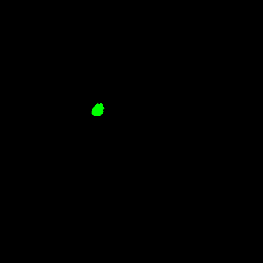</td>
<td>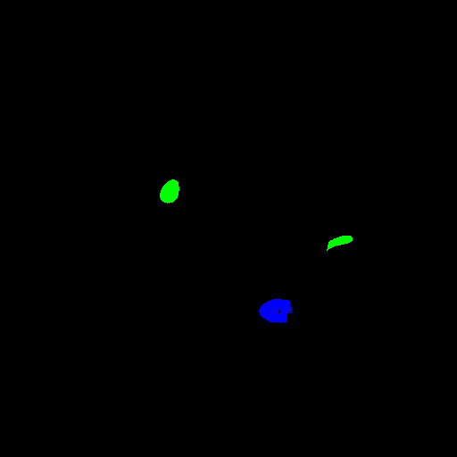</td>
</tr>

<tr>
<td>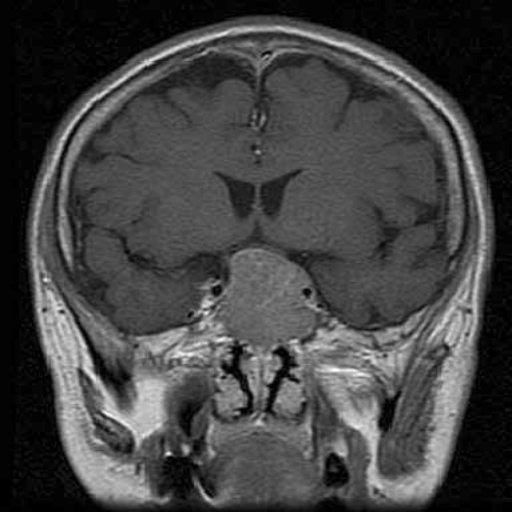</td>
<td>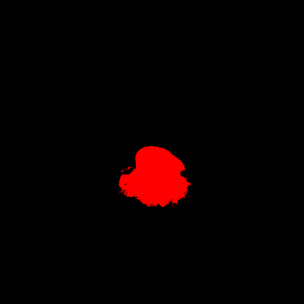</td>
<td>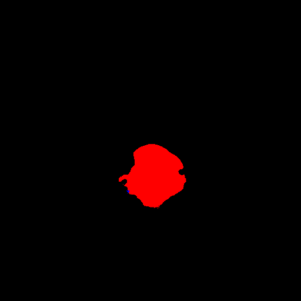</td>
</tr>
</table>

 
<h3>1  Dataset Citation</h3>
The dataset used here was derived from   
<a href="https://www.kaggle.com/datasets/yashharwani/brain-tumor-mri-multi-source-balanced-set">
<b>Brain Tumor MRI Multi-Source Balanced Set</b> </a> by Yash Harwani.
  
The following explanation was taken from above web site.
  
<b>About Dataset</b> 
<b>Overview</b> 
A brain tumor is an abnormal growth of cells within the brain. 
Early detection and accurate classification are critical for selecting appropriate treatment strategies
and improving patient outcomes. This dataset provides a consolidated and refined collection of 
human brain MRI scans designed to support the development of robust deep learning models for automated diagnosis.
  
<b>Why this Dataset?</b> 
Most existing brain MRI datasets suffer from distribution shifts and data leakage. 
For example, one class might come from a specific scanner protocol (e.g., 512x512 grayscale), 
while another comes from a different source (e.g., cropped RGB), 
allowing models to "cheat" by learning image dimensions rather than tumor pathology.
  
This version solves those issues. We have merged, cleaned, and meticulously reshuffled images 
from three major sources to ensure that each class contains a representative mix of all imaging protocols.
  
<b>Dataset Composition</b> 
This collection is a unified "super-set" derived and adapted from: 
Figshare (Cheng et al.) 
Sartaj Dataset 
Br35H Dataset 
 
<b>Specifications</b> 
Total Images: 7,200 MRI scans 
 
<b>Classes:</b> 
Glioma (Malignant tumor) 
Meningioma (Usually benign) 
Pituitary tumor (Endocrine-related) 
No tumor (Healthy scans) 
 
Structure: 80/20 split between Training and Testing folders. 
Format: Balanced class distribution to prevent model bias. 
 
<b>
Key Improvements in this Version</b> 
Resolved Shortcut Learning: Fixed the issue where models could achieve high accuracy by identifying image sizes/resolutions instead of tumors.
 
Cross-Source Balancing: Images from different scanner protocols are distributed across both training and testing sets.
 
Quality Audit: Removed duplicates and corrupted files found in original source splits.
  
<b>License & Attribution</b> 
This dataset is licensed under CC BY 4.0.  
If you use this dataset in your research or projects, 
please credit the original sources (Figshare, Sartaj, Br35H) and this consolidated version.
  
<h3>
2 Brain-Tumor-Balanced-MRI ImageMask Dataset
</h3>
<h3>
2.1 Download ImageMask Dataset
</h3>
 If you would like to train this Brain-Tumor-Balanced-MRI Segmentation model by yourself,
please down load our dataset <a href="https://drive.google.com/file/d/1zdPIMVlcaAoBR5aVkQ6d6Tu_KgSvg8ks/view?usp=sharing">
<b>Brain-Tumor-Balanced-MRI-ImageMask-Dataset.zip</b>
(<a href="https://creativecommons.org/licenses/by-sa/4.0/">CC BY-SA 4.0</a>)
</a> on the google drive,
expand the downloaded, and put it under <b>./dataset/</b> to be.
<pre>
./dataset
└─Brain-Tumor-Balanced-MRI
    ├─test
    │   ├─images
    │   └─masks
    ├─train
    │   ├─images
    │   └─masks
    └─valid
        ├─images
        └─masks
</pre>
 
<b>Brain-Tumor-Balanced-MRI Statistics</b> 
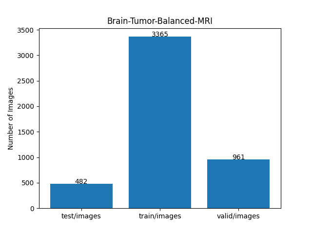 
 
As shown above, the number of images of train and valid datasets is large enough to use for a training set of our segmentation model.
  
<h3>
2.2 Derivation of Brain-Tumor-Balanced-MRI Dataset
</h3>
The folder structure of the original <b>Brain-Tumor-Datase</b> is the following,
but it contains no annotation(mask) files,because it is an image classification dataset. 
<pre>
./Brain-Tumor-Dataset
  ├─Testing
...
  │
  └─Training
        ├─glioma
        │   ├─glioma_p0_s0.jpg
...
        │   └─glioma_p0_s1678.jpg
        │
        ├─meningioma
        │   ├─meningioma_p0_s0.jpg
...
        │   └─meningioma_p11_s5.jpg
        │
        ├─notumor
        │   ├─notumor_p0_s0.jpg
...
        │   └─notumor_p0_s1539.jpg
        │
        └─pituitary
             ├─pituitary_p0_s0.jpg
...
             └─pituitary_p0_s1685.jpg
</pre>
<b>Step 1</b> 
We generated a 512x512 pixsels master PNG train images from all JPG files under 
<b>glioma</b>, <b>meningioma</b> and <b>pituitary</b> folders in <b>Training</b> folder.
  
<b>Step 2</b> 
We generated our own annotation (mask) files corresponding to the master train images 
by applying an inference (segmentation) method of
a pretrained FlexUNet model <a href="https://github.com/sarah-antillia/TensorFlow-FlexUNet-Image-Segmentation-BRISC2025-BrainTumor">
TensorFlow-FlexUNet-Image-Segmentation-BRISC2025-BrainTumor
</a> to all master train images, without human annotation experts.
  
<b>Step 3</b> 
We finally generated our ImageMask Dataset from all pairs of master images and their correspoinding mask files 
generated above steps, not including <b>Testing</b> dataset.
  
<h3>
2.3 Train Sample Images and Masks
</h3>
<b>Train_sample images</b> 
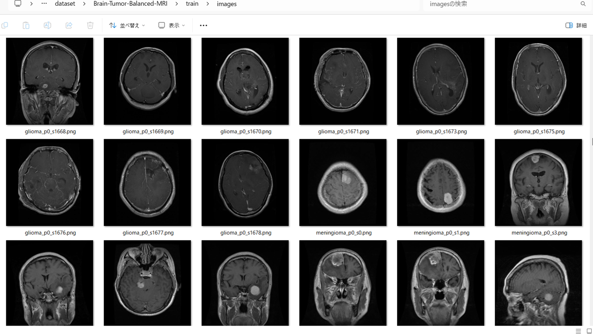
 
<b>Train_sample_masks</b> 
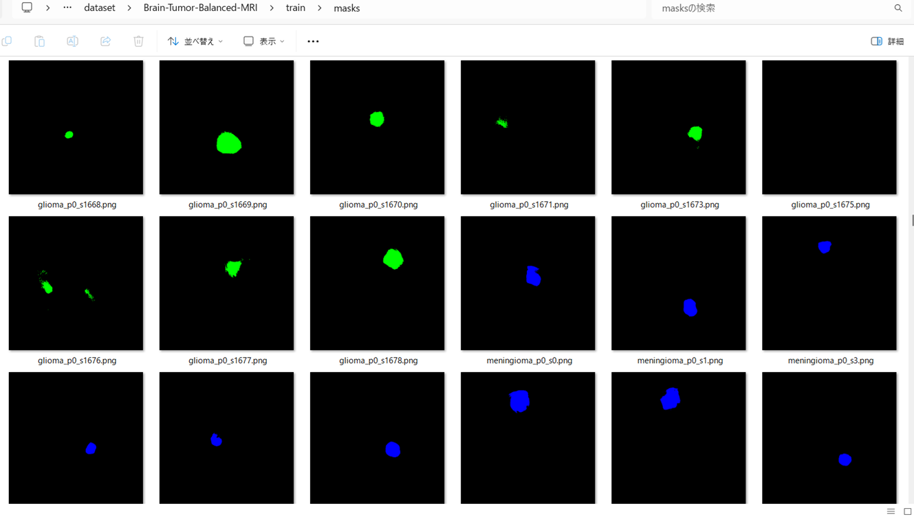
 
<h3>
3 Train TensorflowFlexUNet Model
</h3>
 We trained Brain-Tumor-Balanced-MRI TensorflowFlexUNet Model by using the following
<a href="./projects/TensorFlowFlexUNet/Brain-Tumor-Balanced-MRI/train_eval_infer.config"> <b>train_eval_infer.config</b></a> file.  
Please move to ./projects/TensorFlowFlexUNet/Brain-Tumor-Balanced-MRI and run the following bat file. 
<pre>
>1.train.bat
</pre>
, which simply runs the following command. 
<pre>
>python ../../../src/TensorFlowFlexUNetTrainer.py ./train_eval_infer.config
</pre>

<b>Model parameters</b> 
Defined a small <b>base_filters=16</b> and a large <b>base_kernels=(11,11)</b> for the first Conv Layer of Encoder Block of 
<a href="./src/TensorFlowFlexUNet.py">TensorFlowFlexUNet.py</a> 
and a <b>large num_layers=8</b> (including a bridge between Encoder and Decoder Blocks).
<pre>
[model]
image_width    = 512
image_height   = 512
image_channels = 3
input_normalize = True
normalization  = False
num_classes    = 4
base_filters   = 16
base_kernels  = (11,11)
num_layers    = 8
dropout_rate   = 0.05
dilation       = (1,1)
</pre>

<b>Learning rate</b> 
Defined a small learning rate.  
<pre>
[model]
learning_rate  = 0.00007
</pre>

<b>Loss and metrics functions</b> 
Specified "categorical_crossentropy" and "dice_coef_multiclass". 
<pre>
[model]
loss           = "categorical_crossentropy"
metrics        = ["dice_coef_multiclass"]
</pre>
<b >Learning rate reducer callback</b> 
Enabled learing_rate_reducer callback, and a small reducer_patience.
<pre> 
[train]
learning_rate_reducer = True
reducer_factor     = 0.4
reducer_patience   = 4
</pre>
<b>Early stopping callback</b> 
Enabled early stopping callback with patience parameter.
<pre>
[train]
patience      = 10
</pre>
<b></b> 
<b>RGB color map</b> 
rgb color map dict for Brain-Tumor-Balanced-MRI 1+3 classes. 
<pre>
[mask]
mask_file_format = ".png"
;Brain-Tumor-Balanced-MRI 1+3
;                  Meningioma:blue, Glioma:green, Pituitary tumor:red      
rgb_map = {(0,0,0):0, (0,0,255):1, (0,255,0):2, (255,0,0):3,}       
</pre>
<b>Epoch change inference callbacks</b> 
Enabled epoch_change_infer callback. 
<pre>
[train]
epoch_change_infer       = True
epoch_change_infer_dir   =  "./epoch_change_infer"
epoch_changeinfer        = False
epoch_changeinfer_dir    = "./epoch_changeinfer"
num_infer_images         = 6
</pre>
By using this epoch_change_infer callback, on every epoch_change, the inference procedure can be called
 for 6 images in <b>mini_test</b> folder. This will help you confirm how the predicted mask changes 
 at each epoch during your training process.    
<b>Epoch_change_inference output at starting (1,2,3)</b> 
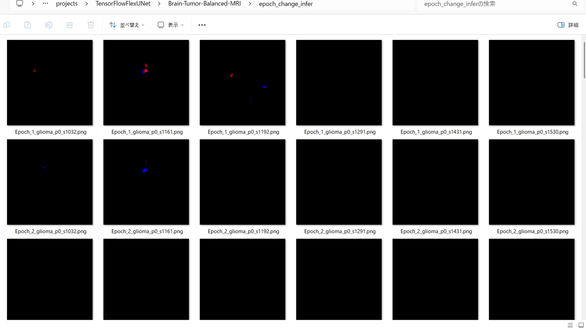 
 
<b>Epoch_change_inference output at middle-point (9,10,11)</b> 
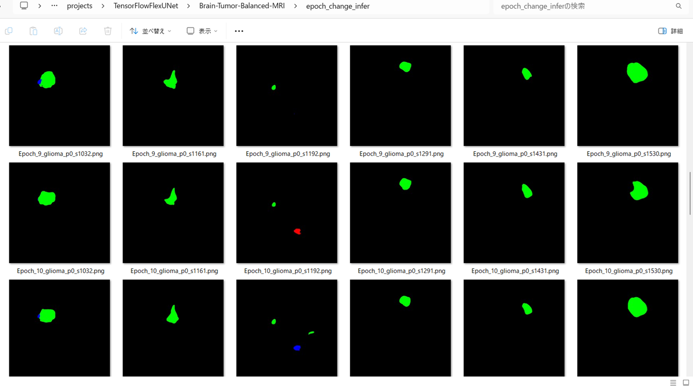 
 
<b>Epoch_change_inference output at ending (19,20,21)</b> 
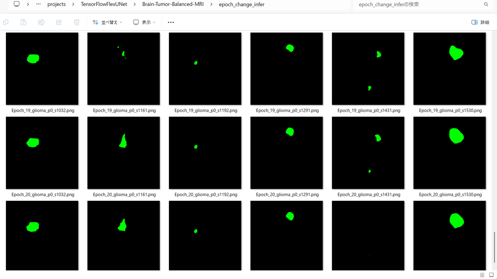 

 
In this experiment, the training process was stopped at epoch 30 by EarlyStoppingCallback.  
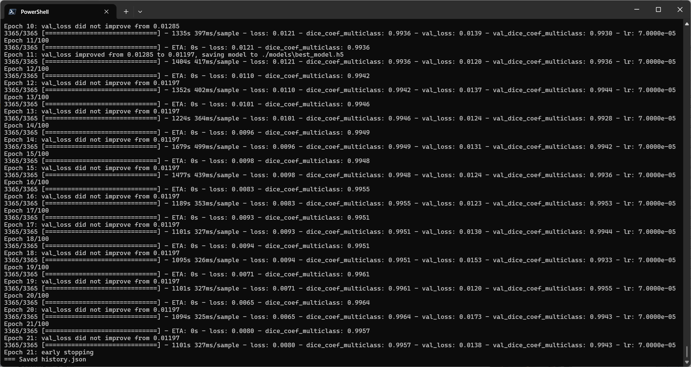 
 
<a href="./projects/TensorFlowFlexUNet/Brain-Tumor-Balanced-MRI/eval/train_metrics.csv">train_metrics.csv</a> 
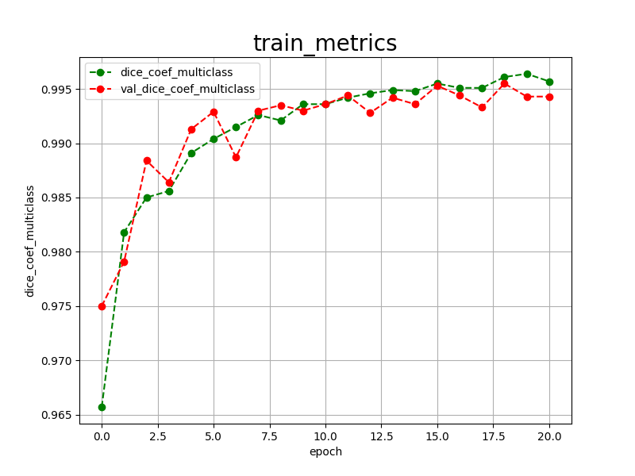 

 
<a href="./projects/TensorFlowFlexUNet/Brain-Tumor-Balanced-MRI/eval/train_losses.csv">train_losses.csv</a> 
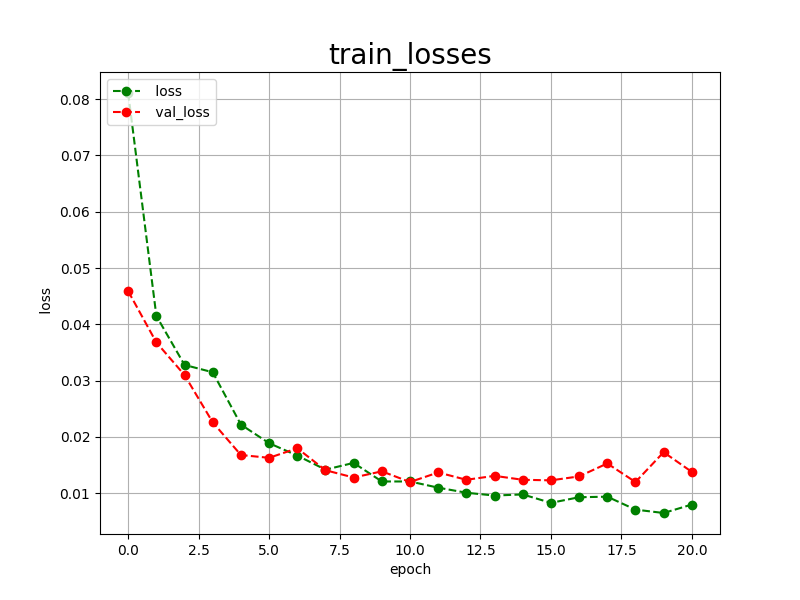 
 
<h3>
4 Evaluation
</h3>
Please move to <b>./projects/TensorFlowFlexUNet/Brain-Tumor-Balanced-MRI</b> folder, 
and run the following bat file to evaluate TensorflowFlexUNet model for Brain-Tumor-Balanced-MRI. 
<pre>
>./2.evaluate.bat
</pre>
This bat file simply runs the following command.
<pre>
>python ../../../src/TensorFlowFlexUNetEvaluator.py  ./train_eval_infer.config
</pre>
Evaluation console output: 
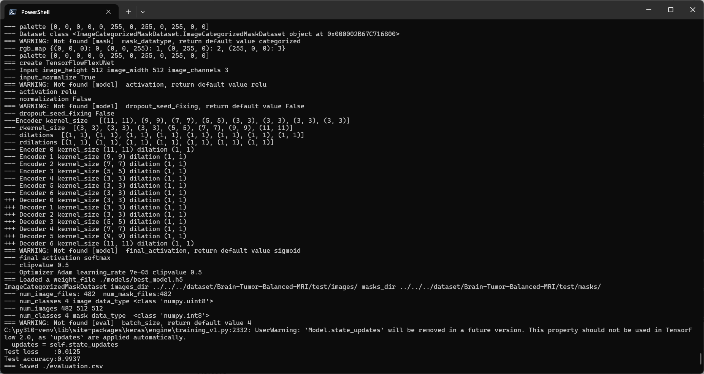
  Image-Segmentation-Brain-Tumor-Balanced-MRI

<a href="./projects/TensorFlowFlexUNet/Brain-Tumor-Balanced-MRI/evaluation.csv">evaluation.csv</a> 
The loss (categorical_crossentropy) to this Brain-Tumor-Balanced-MRI/test was low, and dice_coef_multiclass high as shown below.
 
<pre>
categorical_crossentropy,0.0125
dice_coef_multiclass,0.9937
</pre>
 
<h3>5 Inference</h3>
Please move to <b>./projects/TensorFlowFlexUNet/Brain-Tumor-Balanced-MRI</b> folder 
,and run the following bat file to infer segmentation regions for images by the Trained-TensorflowFlexUNet model for Brain-Tumor-Balanced-MRI. 
<pre>
>./3.infer.bat
</pre>
This simply runs the following command.
<pre>
>python ../../../src/TensorFlowFlexUNetInferencer.py ./train_eval_infer.config
</pre>

<b>mini_test_images</b> 
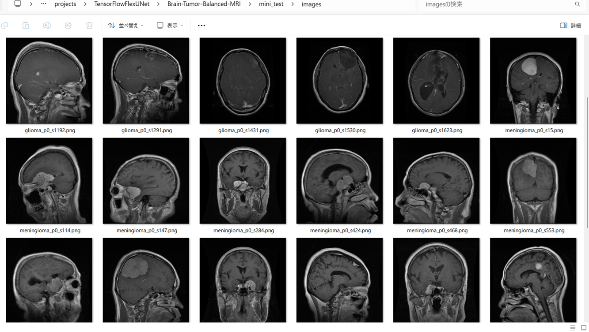 
<b>mini_test_mask(ground_truth)</b> 
 

<b>Inferred test masks</b> 
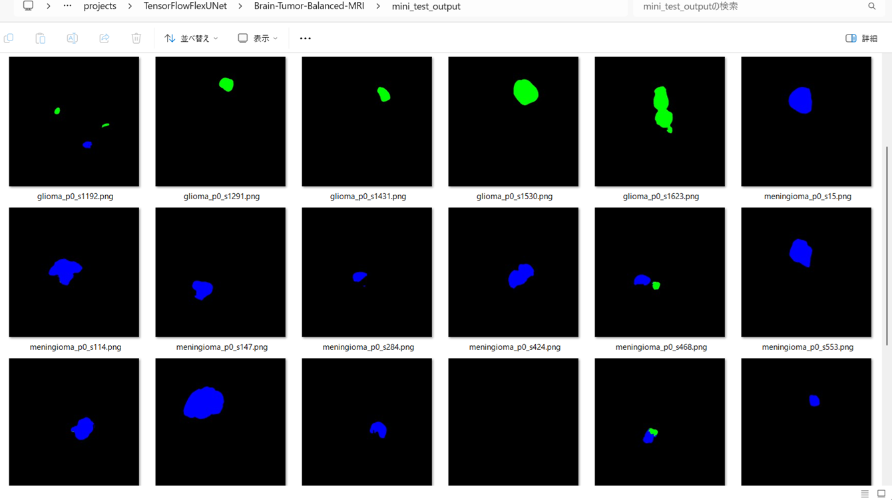 
 

<b>Enlarged images and masks for  Brain-Tumor-Balanced-MRI of 512x512 pixels</b> 
As shown below, the inferred masks predicted by our segmentation model trained by the dataset appear similar to the 
ground truth masks, excepting the fourth case. The predicted <b>green</b> polygonal region  of that case was 
different from the <b>green</b> ground truth shape. 
  
<b>class_color_map = {Meningioma:blue, Glioma:green, Pituitary tumor:red}</b>
 
 
<table>
<tr>
<th>Input: image</th>
<th>Mask (ground_truth)</th>
<th>Prediction: inferred_mask</th>
</tr>
<tr>
<td>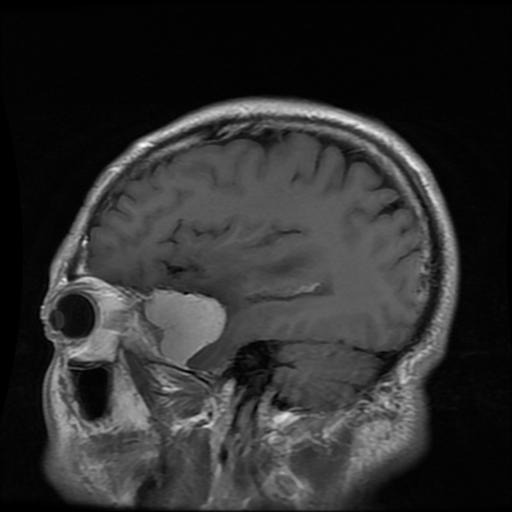</td>
<td></td>
<td>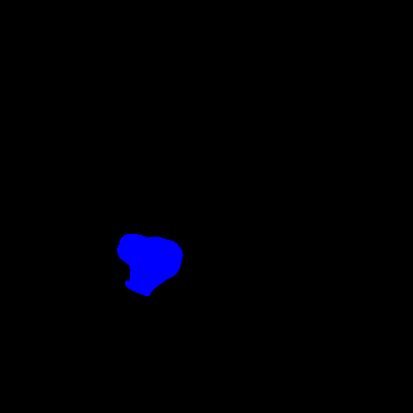</td>
</tr>

<tr>
<td>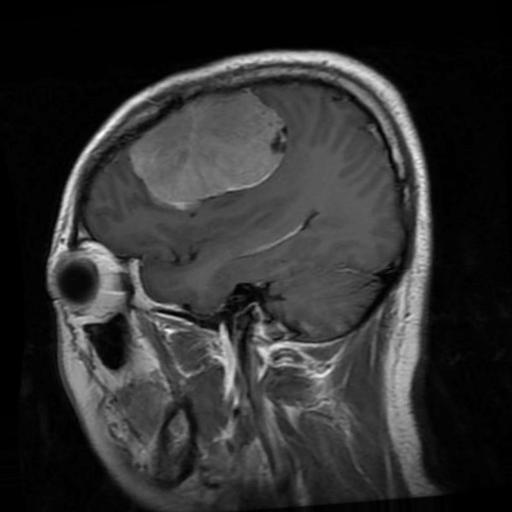</td>
<td>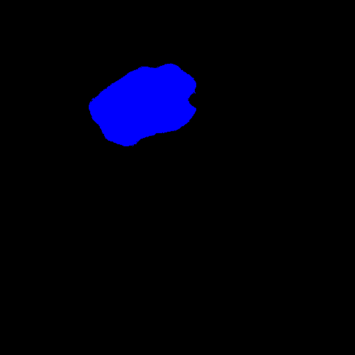</td>
<td></td>
</tr>

<tr>
<td>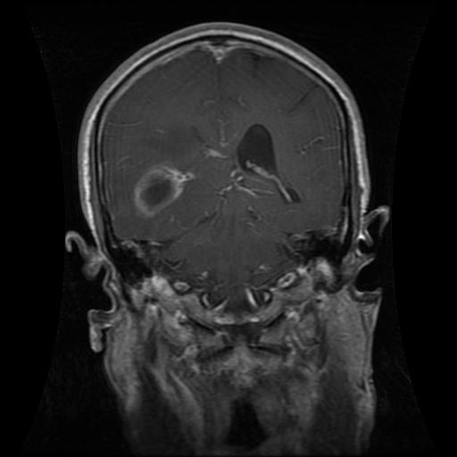</td>
<td></td>
<td>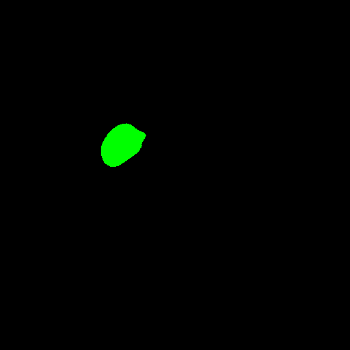</td>
</tr>
<tr>
<td>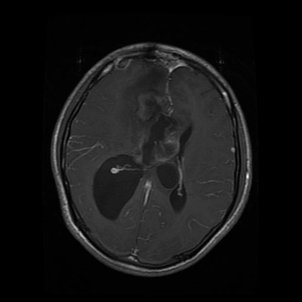</td>
<td>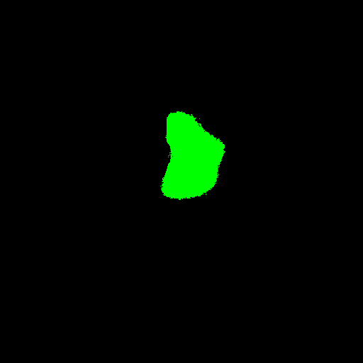</td>
<td>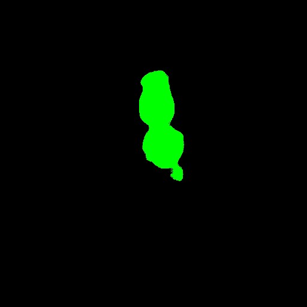</td>
</tr>
<tr>
<td></td>
<td></td>
<td></td>
</tr>
<tr>
<td>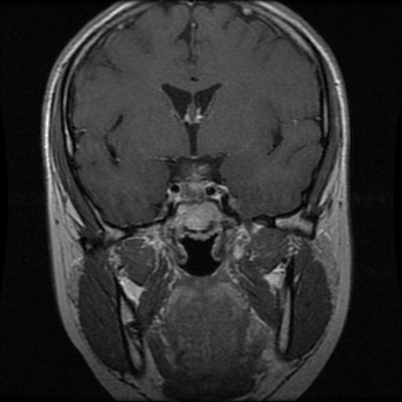</td>
<td>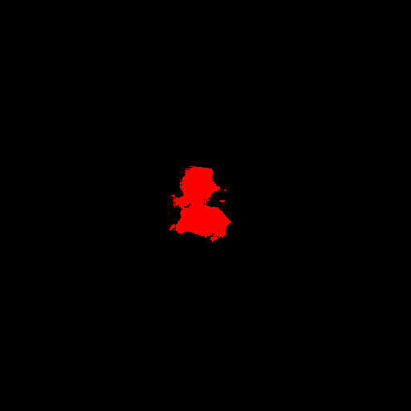</td>
<td>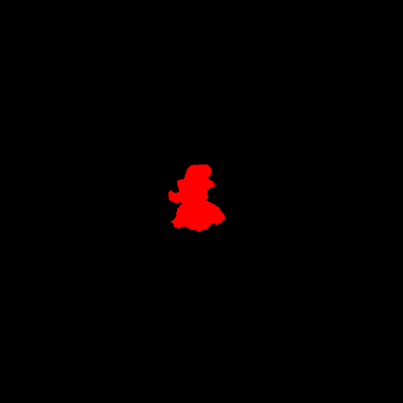</td>
</tr>
</table>

 
<h3>
References
</h3>
<b>1. TensorFlow-FlexUNet-Image-Segmentation-Brain-Tumor-Unified-MRI</b> 
Toshiyuki Arai  
<a href="https://github.com/sarah-antillia/TensorFlow-FlexUNet-Image-Segmentation-Brain-Tumor-Unified-MRI">
https://github.com/sarah-antillia/TensorFlow-FlexUNet-Image-Segmentation-Brain-Tumor-Unified-MRI
</a>
 
 
<b>2. TensorFlow-FlexUNet-Image-Segmentation-Brain-Tumor-Consolidated-MRI</b> 
Toshiyuki Arai  
<a href="https://github.com/sarah-antillia/TensorFlow-FlexUNet-Image-Segmentation-Brain-Tumor-Consolidated-MRI">
https://github.com/sarah-antillia/TensorFlow-FlexUNet-Image-Segmentation-Brain-Tumor-Consolidated-MRI
</a>
 
 
<b>3. TensorFlow-FlexUNet-Image-Segmentation-Crystal-Clean-Brain-Tumor</b> 
Toshiyuki Arai  
<a href="https://github.com/sarah-antillia/TensorFlow-FlexUNet-Image-Segmentation-Crystal-Clean-Brain-Tumor">
https://github.com/sarah-antillia/TensorFlow-FlexUNet-Image-Segmentation-Crystal-Clean-Brain-Tumor
</a>
 
 
<b>4. TensorFlow-FlexUNet-Image-Segmentation-Figshare-BrainTumor</b> 
Toshiyuki Arai  
<a href="https://github.com/sarah-antillia/TensorFlow-FlexUNet-Image-Segmentation-Figshare-BrainTumor">
https://github.com/sarah-antillia/TensorFlow-FlexUNet-Image-Segmentation-Figshare-BrainTumor
</a>
 
 
<b>5. TensorFlow-FlexUNet-Image-Segmentation-BRISC2026-Brain-Tumor</b> 
Toshiyuki Arai  
<a href="https://github.com/sarah-antillia/TensorFlow-FlexUNet-Image-Segmentation-BRISC2026-Brain-Tumor">
https://github.com/sarah-antillia/TensorFlow-FlexUNet-Image-Segmentation-BRISC2026-Brain-Tumor
</a>
 
 
<b>6. TensorFlow-FlexUNet-Image-Segmentation-BRISC2025-BrainTumor</b> 
Toshiyuki Arai  
<a href="https://github.com/sarah-antillia/TensorFlow-FlexUNet-Image-Segmentation-BRISC2025-BrainTumor">
https://github.com/sarah-antillia/TensorFlow-FlexUNet-Image-Segmentation-BRISC2025-BrainTumor
</a>
 
 
<b>7. TensorFlow-FlexUNet-Image-Segmentation-Brain-Tumor-MRI </b> 
Toshiyuki Arai  
<a href="https://github.com/sarah-antillia/TensorFlow-FlexUNet-Image-Segmentation-Brain-Tumor-MRI">
https://github.com/sarah-antillia/TensorFlow-FlexUNet-Image-Segmentation-Brain-Tumor-MRI
</a>
 
 
<b>8. TensorFlow-FlexUNet-Image-Segmentation-Model</b> 
Toshiyuki Arai  
<a href="https://github.com/sarah-antillia/TensorFlow-FlexUNet-Image-Segmentation-Model">
TensorFlow-FlexUNet-Image-Segmentation-Model
</a>
 
 
